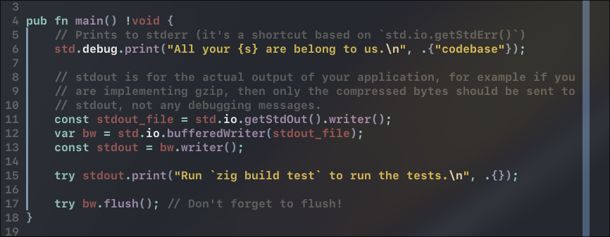

# Ghostty Dark – Neovim Theme

A simple Neovim colorscheme that mirrors the default dark palette of the Ghostty terminal. No frills, no bloat—just colors that match your terminal.

## Preview

<table>
  <tr>
    <td></td>
    <td></td>
  </tr>
</table>

## Installation

**Lazy.nvim**

```lua
{
    "T3rmn/Ghostty_dark_nvim",
    config = function()
        vim.cmd.colorscheme('ghostty_dark')
    end
}
```
## That's it. Once installed, it just works.
## Notes

  Designed specifically for terminals using Ghostty’s default dark color preset.
  Best experienced with true color (termguicolors) enabled.


## Disclaimer

This theme is still under development. If you encounter any issues—such as colors being too similar or certain elements missing highlighting—feel free to open an issue or contribute a fix.
